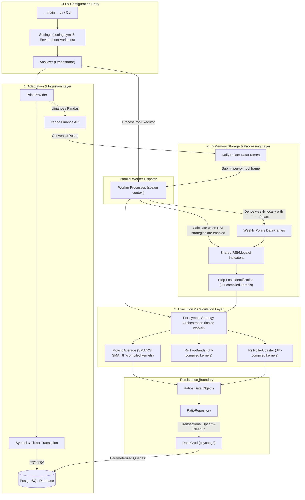

# Radar Core — Financial Strategy Analyzer

Radar Core is a Python application that downloads financial asset prices from Yahoo Finance, processes them using **Polars** DataFrames, and executes high-speed strategy evaluation using **NumPy arrays** and **Numba JIT-compiled kernels**.

The project follows High Performance Practices, using concurrent symbol processing and CPU-optimized JIT kernels. Daily and weekly analyses for each symbol are evaluated sequentially within its worker. Its external runtime infrastructure is supported by the [Radar Infra](https://github.com/NestorDR/radar-infra) project.

The fully operational results can be visited for public use: 
- [Ratios for Stocks](https://radar.ndromero.com/public/dashboard/147ee420-badb-451c-a2d5-c30e78688ed0?profit_vs_change=&security=&strategy=&tab=6-day---open-----%7C#theme=night) 
- [Ratios for Crypto](https://radar.ndromero.com/public/dashboard/0af531b3-df15-4aa4-a665-69704e95451e?profit_vs_change=&security=&strategy=&tab=10-day-open-----%7C#theme=night)
- [All Ratios](https://radar.ndromero.com/public/dashboard/6e547cac-cbc3-4354-97c3-6745d8540d83?gain_prob=0.51&profit_vs_change=-0.20&security=&signals=2&strategy=&time_frame=#theme=night)

## Features
- **Hybrid Data Architecture**:
    - **Polars**: High-performance DataFrame management for data ingestion and storage.
    - **NumPy & Numba**: Strategy logic is decoupled into JIT-compiled kernels for near-native execution speed.
- **Concurrent Analysis**: Multi-symbol processing using Python's `ProcessPoolExecutor`.
- **Yahoo Finance Integration**: Automated download of historical daily prices and local weekly aggregation.
- **Technical Analysis & Strategies**: Built-in support for Moving Averages (SMA), RSI-based variants (RSI SMA, Two Bands, Rollercoaster), and Mogalef Bands used as stop-loss levels for RSI band strategies.
- **Performance Metrics**: Detailed profiling including net profit, success rate, mathematical expectation, trade averages, and exposure.
- **Database Synchronization**: Transactional management of trading ratios and optional cleanup of unlisted symbols via `psycopg3`.
- **Configurable settings**: Symbols, shortable assets, verbosity, concurrency, and enabled strategies.
    
## Prerequisites
- Python 3.13+
- Recommended OS: Windows, Linux, or macOS
- Required libraries (managed via pyproject.toml):
  - polars
  - yfinance
  - numba, numpy, PyYAML, dotenvy-py, psycopg, psycopg-binary, setuptools
  - TA-Lib (see notes below)

TA-Lib on Windows: install the prebuilt wheel noted in pyproject.toml (example shown in Installation). On non‑Windows platforms, TA-Lib can be installed from PyPI (see environment markers in pyproject.toml).

Note: The project is developed on a Windows 11 host using Python 3.13, PyCharm 2026.1+, PostgreSQL 17.x, and Docker Desktop v4.88+.

## Installation
The project uses [uv](https://docs.astral.sh/uv/) for dependency management:

1. Create a virtual environment and install dependencies:
   - `uv venv`
   - `uv sync`
   - For development tools (`ruff`, `ty`, and `pre-commit`), run: `uv sync --group dev --active`
2. **Windows + TA-Lib** (if needed):
   - `uv pip install https://github.com/cgohlke/talib-build/releases/download/v0.6.4/ta_lib-0.6.4-cp313-cp313-win_amd64.whl --no-cache-dir`

## Quick Start
You can run the analyzer directly from the repository without installing the package system‑wide.

- Run as a module (using the CLI entry point):
  - `python -m radar_core`

- Or run as an independent script (useful for specific tests, since it supports the `if __name__ == '__main__':` block):
  - `python src/radar_core/analyzer.py`

The direct `analyzer.py` script uses its hard-coded smoke-test symbol list; use the module command for settings-driven execution.

By default, the analyzer will:
- Initialize settings and database connections.
- Download daily prices and prepare in-memory Polars DataFrames.
- Convert price columns to NumPy arrays and dispatch JIT-compiled kernels for strategy identification.
- Use the configured number of worker processes for symbol-level parallel execution (the `Settings` default is one); daily and weekly analysis run sequentially within each worker.
- Evaluate strategies for daily and weekly timeframes.
- Print atomic, buffered logs per symbol above DEBUG verbosity; DEBUG output is streamed live.

## Architecture
The system follows a three-tier performance model:
1. **Adapter Layer**: Pandas/yfinance for external data compatibility.
2. **Storage Layer**: **Polars** for lightning-fast in-memory data manipulation and grouping.
3. **Execution Layer**: **NumPy + Numba** for the heavy mathematical lifting (JIT-compiled backtesting kernels).



For each symbol, `analyzer.py` downloads daily prices, derives weekly prices with Polars, and evaluates only the strategies enabled in `src/radar_core/settings.yml`. When RSI strategies are enabled, shared RSI and, when required, Mogalef stop-loss indicators are calculated once per timeframe, including JIT-accelerated stop-loss bar scanning. `PriceProvider` uses `SecurityRepository` to translate internal symbols to Yahoo Finance tickers—auto-registering missing symbols from Yahoo Finance into PostgreSQL—and guards against empty ticker downloads before converting the Pandas response to Polars. Strategy execution kernels leverage shared inlined Numba helpers (`src/radar_core/domain/strategies/_kernel_helpers.py`) for crossover detection, trade math, and candidate screening. Strategy execution results (`Ratios`) are managed transactionally by `RatioRepository`, which flags in-process evaluations and atomically persists positive ratios while purging stale flagged rows.

Mogalef bands are used directly as `LongStopLoss` and `ShortStopLoss` for the RSI Two Bands and Rollercoaster strategies. Those strategies retain `identify_old` for baseline comparison while `identify` runs the fused implementation. Serialized current-indicator metadata (`Ratios.current_indicators`) preserves dashboard keys across all strategies, including `sma` (and `rsi` for RSI SMA) for Moving Average variants and `rsi`, `up`, and `low` for RSI band strategies.

## Minimal Example
Below is a minimal snippet that shows how you might pull prices and run a simple analysis, similar to what the analyzer does internally. It requires the project dependencies, database connection settings, and an initialized Radar database with the strategy records.

```python
import polars as pl
from radar_core.infrastructure.price_provider import PriceProvider
from radar_core.domain.strategies import MovingAverage
from radar_core.helpers.constants import DAILY, SMA

# Define a list of symbols to analyze
symbols_ = ['BTC-USD']

# Download prices data for all symbols to be analyzed
prices_data_ = PriceProvider(long_term=False).get_prices(symbols_)

# Configure analyzer
ma = MovingAverage(SMA, value_column_name='Close', ma_column_name='Sma')
only_long_positions_ = False

# Iterate over symbols
for symbol_, prices_df_ in prices_data_.items():
    # The analyzer orchestrates identify() and logging; here we just demonstrate the objects.
    prices_df_ = prices_df_.with_columns(pl.arange(0, pl.len(), eager=False).cast(pl.Int32).alias('BarNumber'))
    close_prices_ = prices_df_['Close'].to_numpy()
    percent_changes_ = prices_df_['PercentChange'].to_numpy()
    ma.identify(symbol_, DAILY, only_long_positions_, prices_df_, close_prices_, percent_changes_)

    # See src/radar_core/analyzer.py for a full run.
```

## Example Output
A typical console output (truncated) may look like:

```console
Reading YAML file settings.yml...
Analyzer.py started at 2025-12-22 09:58:52.
Cleaned 0 rows from the database for deprecated symbols.
Starting parallel analysis for 1 symbols using X workers...

[BTC-USD]: Analysis started at 2025-12-22 09:58:55...
[BTC-USD]: Daily time frame analysis started at 2025-12-22 09:58:55
shape: (1, 7)
┌─────────────────────┬───────┬───────┬───────┬──────┬──────────┐
│ Date                ┆ Open  ┆ High  ┆ Low   ┆ Close┆ Volume   │
├─────────────────────┼───────┼───────┼───────┼──────┼──────────┤
│ 2020-01-01 00:00:00 ┆ …     ┆ …     ┆ …     ┆ …    ┆ …        │
│ …                   ┆ …     ┆ …     ┆ …     ┆ …    ┆ …        │
└─────────────────────┴───────┴───────┴───────┴──────┴──────────┘
SMA         on BTC-USD: start 2025-12-22 09:58:55 ... end 2025-12-22 09:58:58  0.0 min
[BTC-USD]: Analysis completed in 0.0 min
...
Analysis executed from 2025-12-22 09:58:52 to 2025-12-22 09:58:59 - Elapsed time 0.1 min
```

Note: Actual output will vary based on a symbol list, dates, and verbosity. Output blocks per symbol are buffered atomically above DEBUG verbosity; DEBUG output is streamed live.

## Configuration
Project settings are managed by the `Settings` class. You can configure the application via the `src/radar_core/settings.yml` file for the financial strategies and using **Environment Variables** for infrastructure-oriented settings (logging, concurrency, database connection, etc.). The application reads both sources at startup and applies the configurations accordingly. The `evaluable_strategies` list accepts `sma`, `rsi_sma`, `rsi_rc`, and `rsi_2b`.

### Key Environment Variables

| Variable                    | Description                                                                                  | Default                       |
|:----------------------------|:---------------------------------------------------------------------------------------------|:------------------------------|
| `RADAR_ENV`                 | `dev` loads `.env` from the `radar_core` package directory or up to two parent directories; other values use process environment | `dev`                         |
| `RADAR_CLEAN_UNLISTED`      | Delete stored ratios for symbols not listed in `settings.yml`                                | `false`                       |
| `RADAR_LOG_LEVEL`           | Logging verbosity (10=DEBUG, 20=INFO, etc.)                                                  | `20` (INFO)                   |
| `RADAR_ENABLE_FILE_LOGGING` | Write logs to a rotating file                                                                | `false`                       |
| `RADAR_LOG_FOLDER`          | File-log folder, relative to the `radar_core` package when not absolute                      | `logs`                        |
| `RADAR_MAX_WORKERS`         | Number of parallel processes; non-positive values are clamped to one by `Settings`          | `1`                           |
| `RADAR_SETTING_FILE`        | Custom settings YAML path, relative to `src/radar_core` when not absolute                    | `settings.yml`                |
| `POSTGRES_*`                | PostgreSQL host, port, database, user, and password settings                                  |                               |
| `POSTGRES_SSL_MODE`         | PostgreSQL connection SSL mode                                                               | `prefer`                      |
| `POSTGRES_OPTIONS`          | Optional PostgreSQL connection options passed to the connection                          | unset                         |

## Docker
Containerization is available for the application environment. The multi-stage image builds the TA-Lib C library inside the container, eliminating host setup requirements.

### Build and Run
```bash
docker build -t radar-core:dev-0.5.0 -f docker/Dockerfile .
```

Run with Docker (connecting to PostgreSQL):
```powershell
docker run --rm `
    -e POSTGRES_HOST=host.docker.internal `
    -e POSTGRES_PORT=5432 `
    -e POSTGRES_DB=radar `
    -e POSTGRES_USER=postgres `
    -e POSTGRES_PASSWORD=your_password `
    -e RADAR_SETTING_FILE=/home/default/app/settings.yml `
    -e RADAR_ENABLE_FILE_LOGGING=false `
    -e RADAR_LOG_LEVEL=20 `
    -e RADAR_MAX_WORKERS=4 `
    radar-core:dev-0.5.0
```

### Docker Compose
Two Compose targets are provided in `docker/`, configured via environment files in `envs/`:
- **Core Analyzer**: `docker compose -f docker/docker-compose.core.yml up -d --build` (helper: `auto\dc.cmd core`).
- **Metabase Dashboard**: `docker compose -f docker/docker-compose.mb.yml up -d` (helper: `auto\dc.cmd mb`).

Comprehensive multi-environment deployments (dev, e2e, prod) and database infrastructure are managed in [Radar Infra](https://github.com/NestorDR/radar-infra).

## Automation Scripts
The `auto/` directory contains Windows Command scripts to simplify common tasks:

- **`auto\dc.cmd <target>`**: Helper for Docker Compose.
  - Usage: `auto\dc.cmd core`.
  - It handles environment file injection and project naming.

- **`auto\update.cmd`**: Updates the development environment.
  - Updates `uv`, upgrades `uv.lock`, syncs dependencies, and re-installs TA-Lib from the prebuilt wheel.

- **`auto\lint.cmd`**: Automatic lint checks and corrections.
  - Runs Ruff lint checks and autofixes; Ruff formatting is currently disabled in the script.

- **`auto\test.cmd`**: Testing is implemented using `pytest`. Unit tests are located under the `tests/` directory.
  - The test suite includes fast, in-memory unit tests using `pytest` and `unittest.mock` covering symbol translation and auto-creation, price provider download guards, model instantiation, error handling, and CRUD methods without external database dependencies.

- **`auto\cleanup.cmd`**: Cache and temporary file cleanup.
  - Clears Python bytecode caches (`__pycache__`) and cleans Ruff cache using `uvx ruff clean`.

## Project Status
In active development and continuous improvement. External runtime infrastructure and end-to-end environments are managed in the [Radar Infra](https://github.com/NestorDR/radar-infra) project. This repository contains the application, database schema files, Docker services, and CI/CD workflow.

## License
This project is licensed under the GNU Affero General Public License v3.0 (AGPL-3.0). See the [LICENSE](LICENSE) file for the full license text.

Under this license, if you modify this software or run it as a network service (SaaS), you must make your modified source code publicly available under the same terms.
